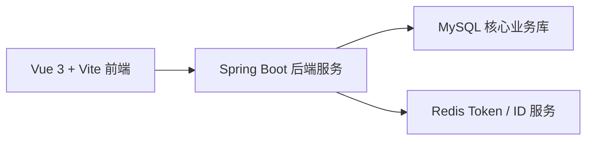
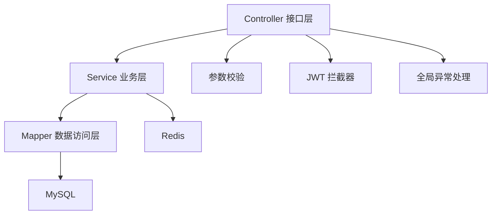
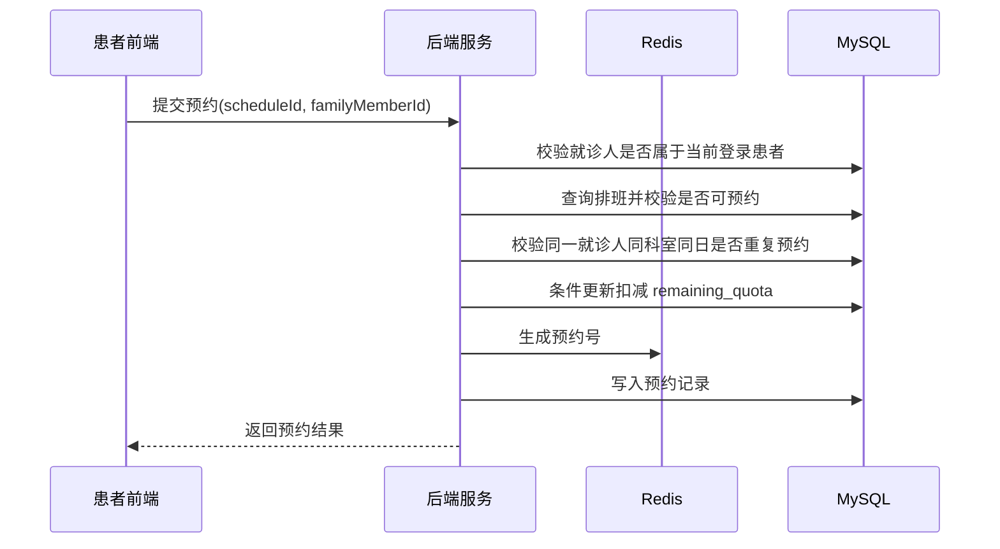

# 项目说明文档

## 1. 项目概述

本项目是一个面向医院线上预约挂号场景的前后端分离系统，目标是让患者能够在线完成注册登录、查看科室与医生、维护就诊人、提交预约、查询预约记录和取消预约等核心操作，减少线下窗口排队压力，提高挂号流程效率。

系统当前已经覆盖一条完整的挂号主链路：

- 患者手机号 / 邮箱注册与登录
- 基于 JWT + Redis 的身份校验
- 科室列表查询
- 按科室分页查询医生
- 医生详情查询
- 查询医生未来 7 天排班
- 就诊人新增、修改、删除、设默认
- 提交预约
- 我的预约分页查询
- 取消预约

项目定位不是做一个“页面能跑通”的演示系统，而是尽量贴近真实在线挂号业务，在有限开发周期内重点把预约规则、权限边界和数据一致性这几个核心问题设计清楚。

---

## 2. 技术选型及原因

### 2.1 后端技术选型

- `Spring Boot 3.3.5`
  原因：Spring Boot 生态成熟，适合快速搭建业务型 Web 系统。它对配置管理、接口开发、事务控制、全局异常处理、拦截器等能力支持完善，能够很好承载预约挂号这类典型后台业务。

- `Java 17`
  原因：作为 Spring Boot 3 的主流运行环境，版本稳定，语法和运行时能力较新，兼顾开发体验和工程稳定性。

- `MyBatis-Plus 3.5.16`
  原因：相较于原生 MyBatis，MyBatis-Plus 能减少大量样板 CRUD 代码，同时仍然保留 SQL 可控性。对于挂号系统这种“规则清晰、查询较多、部分场景需要精细控制 SQL”的项目，它比纯 ORM 更容易兼顾开发效率与可维护性。

- `MySQL`
  原因：挂号业务中的患者、医生、排班、预约记录都属于强结构化数据，彼此之间存在明确关联关系和约束规则，关系型数据库更适合承载这类核心业务数据，并能够通过唯一索引、事务等机制保证一致性。

- `Redis`
  原因：
  1. 用于生成全局唯一预约号，避免业务编号依赖数据库自增主键。
  2. 用于保存登录 token，实现服务端可控的会话管理。
  3. 适合处理高频读写、轻量状态数据这类场景。

- `JWT`
  原因：适合前后端分离系统的身份认证场景，前端只需在请求头中携带 token 即可完成鉴权；同时结合 Redis 进行二次校验后，既保留了 JWT 的便捷性，也增强了登录态可控性。

- `Spring Validation`
  原因：可以在控制器入口统一进行参数合法性校验，把非法请求尽早拦截在接口层，降低后续业务处理复杂度。

- `Lombok`
  原因：用于减少实体类、DTO、构造方法等样板代码，让代码更聚焦在业务逻辑本身。

### 2.2 前端技术选型

- `Vue 3`
  原因：Vue 语法直观、组件化能力成熟，适合中小型业务系统快速开发；对于登录页、首页、就诊人管理、预约列表等常见业务页面，开发效率较高。

- `Vite`
  原因：开发服务器启动快、热更新快，能明显提升前后端联调效率，适合课程项目和迭代型开发。

- `Vue Router`
  原因：系统存在登录、首页、医生列表、就诊人管理、我的预约等多个页面，需要路由机制组织页面跳转和权限控制。

- `Element Plus`
  原因：当前项目主要使用其消息提示能力来统一成功 / 失败反馈。对于预约成功、取消失败、登录失效等交互场景，统一的提示机制能改善用户体验，也减少重复封装成本。

### 2.3 选型背后的整体考虑

本项目在技术选型上遵循三个原则：

1. 优先选择成熟稳定、学习成本适中、便于快速落地的技术。
2. 对核心挂号链路保留足够的数据一致性控制能力，而不是只追求页面效果。
3. 保证前后端分层清晰，便于后续继续扩展排班管理、通知提醒、就诊完成等功能。

换句话说，本项目不是追求“技术栈越新越好”，而是追求“当前业务场景下是否足够合适”。

---

## 3. 项目架构图

### 3.1 总体架构

说明：

- 前端负责页面展示、表单提交、路由跳转和 token 持久化。
- 后端负责鉴权、业务规则判断、事务控制和数据访问。
- MySQL 保存患者、就诊人、医生、排班、预约等核心数据。
- Redis 负责保存登录 token 和生成全局唯一业务编号。

### 3.2 后端分层架构

各层职责如下：

- `Controller`：接收请求、完成参数绑定、返回统一结果。
- `Service`：承载预约创建、取消预约、就诊人校验等核心业务逻辑。
- `Mapper`：执行具体数据库操作和复杂查询。
- `Interceptor / Validation / Advice`：分别负责登录态校验、参数校验和异常统一处理。

### 3.3 在线挂号核心流程图

这个流程体现了本项目的核心思想：预约并不是简单插入一条记录，而是一个需要同时经过权限校验、业务规则校验和号源扣减控制的复合型事务操作。

---

## 4. 业务思考：针对在线挂号场景，我考虑了哪些特殊业务规则

在线挂号与普通电商下单有相似之处，例如都涉及“库存”扣减；但它又有更强的业务约束，因为医疗资源具备更高稀缺性，也涉及更严格的身份和权限边界。因此在设计时，我重点考虑了以下规则。

### 4.1 同一就诊人同一科室同一天只能预约一次

这是在线挂号中非常关键的一条规则。

原因：

- 防止同一患者因误操作重复挂号，占用有限号源。
- 防止恶意囤号，影响其他患者预约。
- 更符合实际医院“同科室同日一次挂号即可完成一次就诊”的业务习惯。

当前实现：

- 业务层在预约前先查询是否存在有效预约记录。
- 数据库层通过唯一约束 `uk_member_dept_date (member_id, department_id, appointment_date)` 再次兜底。

这样设计的好处是：平时用户能得到明确、友好的重复预约提示；并发竞争时即使业务查询瞬间失效，数据库仍能守住最终一致性。

### 4.2 号源有限，必须防止超卖

在线挂号最敏感的资源就是号源。一个医生某天某时段能接多少患者，通常是固定的，不能因为并发请求而出现多个人同时抢到最后一个号的情况。

当前考虑包括：

- 排班必须存在。
- 排班不能处于停诊状态。
- 剩余号源必须大于 0。
- 扣减号源时不能只“先查再减”，而要带条件更新。

在代码实现里，预约创建会校验 `remaining_quota > 0`，并通过条件更新确保只有在确实还有号的情况下才能扣减成功；如果扣减后余号为 0，则把排班状态切换为“已约满”。

### 4.3 排班存在不等于排班可预约

医疗场景里，排班并不是一条静态数据。即使数据库里存在某条排班记录，也不代表一定可以挂号。

本项目区分了以下状态：

- `1`：可预约
- `2`：已约满
- `3`：停诊

这样做的意义在于，系统不仅要管“有没有记录”，还要管“当前业务状态是否允许预约”。例如医生临时停诊时，虽然排班记录仍然保留，但状态不允许继续预约。

### 4.4 取消预约要有时间窗口限制

如果系统允许用户在任意时刻随意取消，会带来两个问题：

- 患者长时间占号，导致其他患者无法预约。
- 临近就诊时间再取消，会影响医院排班利用率。

因此当前项目设置的业务规则是：

- 预约创建后 30 分钟内允许取消。
- 超过 30 分钟后不允许取消。

虽然这个时间窗口还可以根据医院实际政策进一步调整，但它体现了一种核心思路：取消预约不是简单前端按钮，而是需要纳入业务规则治理。

### 4.5 就诊人必须属于当前登录患者

线上挂号经常支持“本人挂号”和“为家属挂号”，所以系统允许患者维护多个就诊人。但这也意味着必须防范参数篡改导致的越权问题。

因此本项目在预约时不是只根据 `familyMemberId` 查询，而是同时校验：

- `familyMember.id = 提交的 familyMemberId`
- `familyMember.patient_id = 当前登录患者 patientId`

只有两者同时满足，才允许继续挂号。这样可以避免用户通过伪造请求，为不属于自己的就诊人预约。

### 4.6 登录态不仅校验 JWT，还要校验 Redis 中的 token

纯 JWT 模式虽然实现简单，但它有一个明显问题：如果 token 已经签发，只要没过期，就无法服务端立即失效。这对普通系统可能还能接受，但医疗预约系统涉及个人信息和预约资格，安全要求更高。

所以当前项目设计为：

1. 登录成功后生成 JWT。
2. 将 token 写入 Redis，并以患者 ID 作为索引。
3. 请求进入后，先检查请求头中的 token 是否存在且格式正确。
4. 再根据 token 解析出 patientId。
5. 到 Redis 中查询该 patientId 当前缓存的 token 是否一致。
6. 只有 Redis 校验通过后，才认定登录态有效。

这个设计带来的好处是：

- 用户退出登录后，Redis 中 token 删除，旧 token 可立即失效。
- 多端重复登录时，也更容易控制旧 token 的失效策略。
- 比单纯依赖前端本地存储更安全。

### 4.7 冗余关键查询字段，换取业务查询效率

预约记录表中保留了 `department_id`、`appointment_date`、`time_slot` 等字段，即使这些信息理论上也能通过排班表或医生表关联得到。

这样设计的原因是：

- 便于直接完成“我的预约”查询和展示。
- 便于做“同一就诊人同科室同日是否重复预约”的快速校验。
- 降低高频查询时的关联复杂度。

这属于典型的业务系统设计权衡：适当冗余换取读操作效率和规则判断简化。

---

## 5. 如何保证数据一致性

这是本项目最核心、也最值得重点说明的部分。

在线挂号的难点并不在于“页面能不能提交”，而在于以下问题：

- 多个用户同时挂同一个号时会不会超卖？
- 同一用户快速重复点击会不会产生多条预约？
- 取消预约后号源能不能正确回补？
- 登录态和数据权限是否能真正对应当前用户？

围绕这些问题，本项目主要从以下几个层面保证一致性。

### 5.1 使用事务保证关键写操作的原子性

预约创建和取消预约都使用了：

- `@Transactional(rollbackFor = Exception.class)`

其作用非常关键。

对于“创建预约”来说，至少包含两步核心操作：

1. 扣减排班剩余号源。
2. 写入预约记录。

这两步必须要么一起成功，要么一起失败。否则就会出现：

- 号源扣了，但预约记录没插入成功。
- 预约记录插入了，但号源其实没扣减。

对于“取消预约”来说，也至少包含两步：

1. 把预约状态改成已取消。
2. 把排班剩余号源加回去。

如果没有事务，任何一步异常都会导致业务数据前后不一致。

因此，事务在这里并不是“锦上添花”，而是预约系统最基本的底线保障。

### 5.2 业务校验与数据库约束双重保障重复预约问题

“同一就诊人同一科室同一天只能预约一次”这条规则，如果只靠业务层查询，会受到并发竞争影响；如果只靠数据库唯一约束，又会导致用户每次都只能看到底层报错，不够友好。

所以项目采取“双保险”策略：

1. 先在业务层查询是否已存在未取消的预约。
2. 再由数据库唯一索引 `uk_member_dept_date` 兜底。
3. 如果并发下触发 `DuplicateKeyException`，统一转换成明确的业务异常提示。

这种设计兼顾了：

- 用户体验
- 并发安全
- 数据库最终一致性

### 5.3 通过条件更新控制号源扣减，降低超卖风险

防止超卖不能只靠“先查库存再减库存”，因为在并发场景下，多个请求可能几乎同时读到“还有 1 个号”。

项目中的处理方式是：

- 先做一次正常业务判断。
- 真正扣减时使用带条件的更新语句，要求 `remaining_quota > 0` 才允许更新成功。

如果更新失败，说明在当前事务提交前，号源已经被其他请求抢完，此时直接返回“当前号源已约满”。

这个方案虽然还不是分布式锁级别的极致并发控制，但对于当前课程项目和中小规模系统来说，是一个成本与效果较平衡的方案，也比纯前端限制或纯内存判断更可靠。

### 5.4 取消预约时同步回补号源，保证状态闭环

取消预约不是只把状态从“待就诊”改成“已取消”就结束了，还必须同步考虑排班剩余号源的恢复。

当前项目在取消成功后会：

1. 更新预约状态为已取消。
2. 记录取消时间。
3. 将对应排班的 `remaining_quota + 1`。
4. 如果排班不是停诊状态，则把状态恢复为可预约。

这样做的价值在于：

- 预约状态和号源数据始终保持联动。
- 被释放出来的号源可以继续被其他患者预约。
- 整个预约生命周期形成闭环。

### 5.5 Redis 生成业务唯一预约号，避免对数据库自增主键过度依赖

预约记录表本身有数据库主键，但对外展示的预约号不能简单等同于数据库自增 ID。

项目中使用 `RedisIdWorker` 生成预约号，带来的好处包括：

- 全局唯一
- 并发下冲突概率低
- 不暴露底层数据库自增规律
- 后续更容易扩展为分布式部署

这属于业务标识和数据库主键分离的设计思路，更符合真实系统习惯。

### 5.6 登录态一致性和数据权限一致性同步控制

在很多简单项目里，只要前端本地还有 token，请求就默认放行。但这样会带来两个问题：

- token 退出后无法及时失效
- 数据权限容易和真实登录态脱节

本项目通过 `JWT + Redis` 联合校验来控制登录态，再结合 `PatientContext` 在请求周期内传递当前患者 ID，使后续业务查询都能明确知道“当前操作人是谁”。

这样一来，就能进一步保证：

- 只有当前登录用户才能查看自己的预约记录
- 只有当前登录用户才能取消自己的预约
- 只有当前登录用户才能为自己的就诊人挂号

因此这里保证的不只是“认证一致性”，也是“权限一致性”。

### 5.7 一致性设计的边界与后续可升级方向

当前方案已经能够较好支撑课程项目和中小规模预约场景，但如果系统未来并发量继续上升，还可以继续优化：

- 为排班表增加版本号，升级为标准乐观锁方案。
- 在极高并发秒杀式场景下引入分布式锁或消息队列削峰。
- 增加定时任务处理爽约、就诊完成、通知发送等状态流转。
- 补充审计日志和操作留痕，提高生产环境可追踪性。

也就是说，当前方案重点解决的是“核心业务正确性”，未来还能继续向“高并发能力”和“生产级治理能力”演进。

---

## 6. 项目亮点与不足

### 6.1 当前亮点

- 前后端分层清晰，接口职责明确，适合后续继续扩展。
- 挂号主链路完整，覆盖登录、查询、就诊人、预约、取消预约等关键流程。
- 针对在线挂号场景考虑了重复预约、号源超卖、停诊、取消窗口、越权操作等关键规则。
- 登录态采用 `JWT + Redis` 双校验，比纯 JWT 更安全可控。
- 通过事务、唯一约束、条件更新等方式，对数据一致性做了较完整处理。

### 6.2 当前不足

- 当前号源扣减方案适合中小规模并发，尚未上升到高并发分布式架构级别。
- 排班能力目前以未来 7 天查询为主，还没有更复杂的门诊模板化配置。
- 暂未实现短信提醒、就诊前通知、爽约处理等延伸业务。
- 暂未补充自动化测试、监控、审计日志等更偏生产化的能力。

---

## 7. 使用 AI 编程工具的体会

本项目在开发过程中使用了 AI 编程工具辅助完成需求拆解、代码实现、前后端联调、异常排查和文档整理。这部分我认为必须单独说明，因为它确实改变了开发效率，但也不能被神化。

### 7.1 AI 工具带来的帮助

#### 1. 提高了基础编码效率

对于结构明确、重复性较高的工作，AI 能明显提速，例如：

- 搭建前后端项目基础骨架
- 编写常规 DTO、实体类、接口层代码
- 整理部分通用工具类和提示封装
- 生成初版文档和说明材料

这些工作如果完全手写会耗费很多时间，而 AI 可以先给出一个可用初稿，再由开发者结合项目情况细化。

#### 2. 提高了联调和排错效率

在项目推进过程中，像下面这些问题都很适合借助 AI 辅助定位：

- 登录成功后为什么没有正确跳转
- token 校验逻辑为什么前后不一致
- 某个字段删除后还有哪些地方残留引用
- 前端交互提示为什么表现不统一

AI 在“快速梳理影响范围”和“给出排查思路”方面确实很有帮助，能明显缩短问题定位时间。

#### 3. 提高了文档产出效率

课程项目往往不仅要求代码实现，还要求说明文档、设计说明、业务分析等材料。如果完全依赖手工整理，往往容易漏项、耗时也长。

AI 可以先基于代码结构输出一版完整文档框架，再由开发者补充：

- 为什么这样设计
- 哪些规则是针对真实业务加上的
- 哪些地方还存在边界和不足

这样产出的文档会更完整，也更容易和代码保持一致。

### 7.2 我对 AI 编程工具的真实感受

我认为 AI 更适合作为“开发协作助手”，而不是“自动替代开发者”的工具。

原因很直接：AI 可以帮忙生成代码，但它并不天然理解医院挂号场景的真实业务边界。例如：

- 同科室同日只能挂一次，这是不是合理规则？
- 取消预约为什么要限制 30 分钟？
- 号源扣减失败后应该返回什么提示？
- 纯 JWT 为什么不够，要不要配合 Redis？

这些问题的关键不在于代码怎么写，而在于业务是否想清楚。一旦业务判断错了，即使代码写得再快，也只是更快地把错误实现出来。

### 7.3 使用 AI 时必须保持的警惕

在本项目里，我最大的体会是：越是涉及事务、权限、并发、一致性的部分，越不能直接照搬 AI 输出，必须人工复核。

因为 AI 常见的问题包括：

- 容易给出“看起来合理”但不完全贴合真实业务的方案
- 对并发边界和异常链路考虑不够严谨
- 可能忽略数据库约束、状态流转和权限校验之间的配合

所以正确的使用方式应该是：

1. 让 AI 帮忙提高实现速度。
2. 由开发者负责业务判断和关键代码把关。
3. 对核心链路进行人工验证，尤其是预约创建、取消预约、鉴权和越权防护。

### 7.4 总结

总体来说，AI 编程工具在本项目中的价值主要体现在三个方面：

- 提升编码效率
- 缩短联调与排错时间
- 加快文档整理速度

但我更深的体会是：AI 能帮助“更快地完成开发”，却不能代替开发者“对业务负责”。对于在线挂号这种强规则、强一致性的场景，真正决定项目质量的，仍然是开发者对业务的理解深度，以及对关键边界问题的把控能力。
